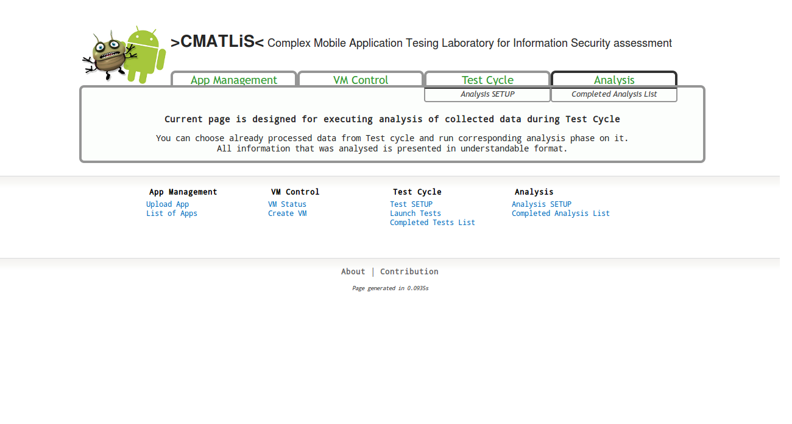
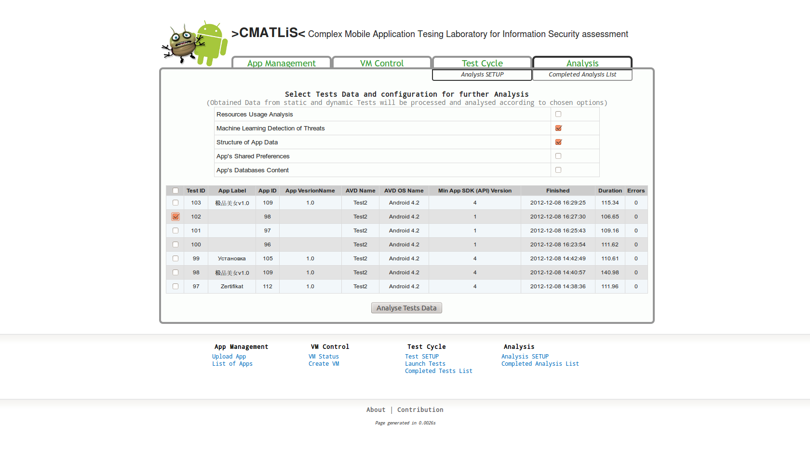
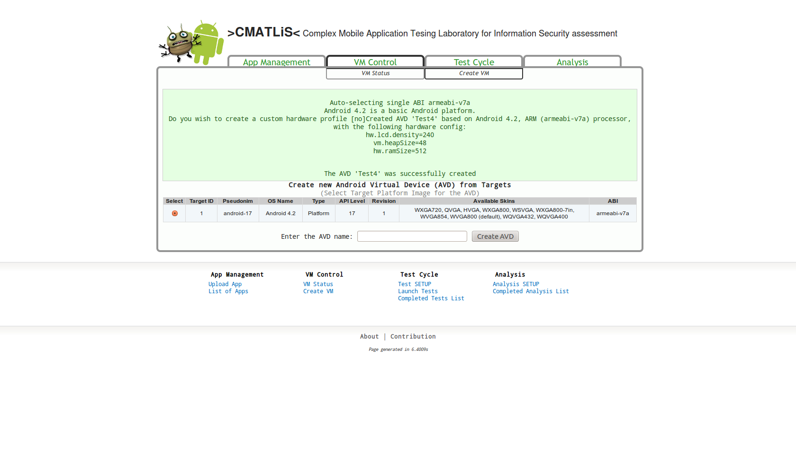
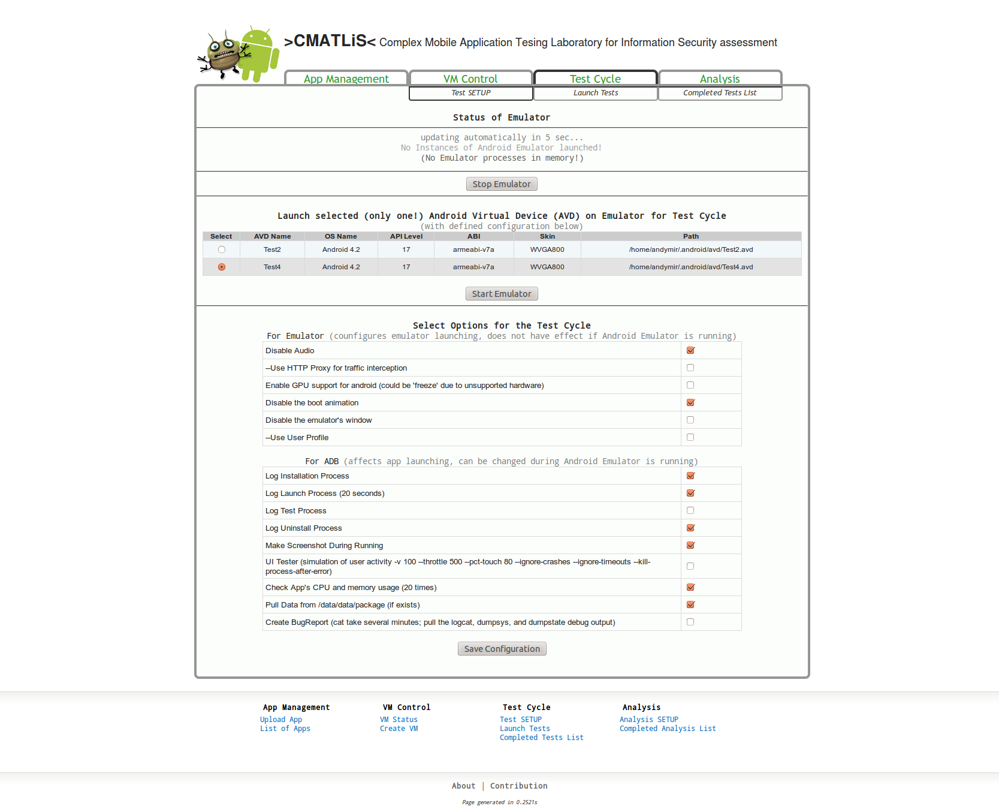
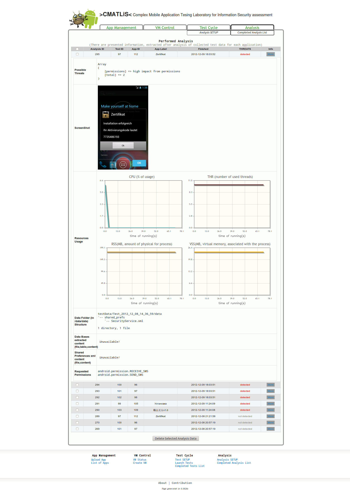

## >CMATLiS< - Complex Mobile Application Tesing Laboratory for Information Security assessment 

Testing laboratory created for the purpose of behavioural dynamic automated analysis fo malware and goodware files. This is the project I designed to facilitate automated analysis of APK malware and benign files and easy mobile malware triage.

Detailed description and technical report: file _TechReport__AndroidLab.pdf

## Usage of the AndroidLab
- Install all necessary software components from the "Requirements" section
- Import mobileLaboratory.sql to your MySQL server
- Go to virtual host of your web server where the files are placed

## Directory Structure
- apkFiles/ -  storage for processed APK files
- testData/ -  folder for storing data extracted during test cycle
- tmpUploda/ - a user can put all APK files for batch procesing
- templates/ - HTML-based templates of the pages
- js/ - JavaScript-related libraries and files like jQuery
- misc/ - logos, iamges, etc
- analysis.php: This file provide functionality for uploading and processign aploaded Android APK packages (applications). After processing, all information are stored in the database for future analysis.  At the moment, there is only one file can be uploaded at the moment. 
  If you need to process bunch of APK files, please put it into the folder, defined by $tmp_folder in config.ini.php
- app_management.php: This file provides functionality for comprehensive analysis of collected static and dynamic test data. Additionally, it provides estimation of threats, which application can posses to the user. 
- checkEmu.php: Provides information about launched AVDs and different states of launch process.
- checkTests.php: Provides information about recently completed 5 tests in descendent order for displaying on the page.  
- config.inc.php: This file is used to define important environmental varibales. Additionally there are several performed check in orer to avoid errors and improper usage.
- index.php: Provides general description of the system
- statistics.php Various statistics regarding permissions
- test_cycle.php: rovides flexible configurable test environment based on Android SDK Emulator. User can configure Emulator and Android Debugging Bridge (which are used further during test cycle) and launch one of available Android Virtual Devices (AVD).  Also, it is possible to select which options should be executed and logged during the test. During running the test, infromation about executed test is automatically updated every 10 seconds on the screen. 
- vm_control.php:  Allows user to check what Target Platforms are installed and available on the system. Additionally, it is possible to create AVD and see other that are available.

## Requirements

- Linux (kernel version =>3.0)
- Android SDK (revision =>21)
- Apache Web Server (version => 2.2)
- PHP (version => 5.3)
- MySQL (version => 5.1) 
- jQuery library (version => 1.8)
- Android SDK Platform Package (version => 1.5, but requires higher versions for some applications)
- SQLite3 (+support for PHP)
- tool 'tree' for Linux

## Original Paper

You can find more information about the practical experiments and datasets in the following conference paper:

	@mastersthesis{shalaginov2013automatic,
		title={Automatic rule-extraction for malware detection on mobile devices},
		author={Shalaginov, Andrii},
		year={2013},
		school={Gj{\o}vik University College}
	}

## Misc

The interface and functionality of the testing laboratory are presented below.

